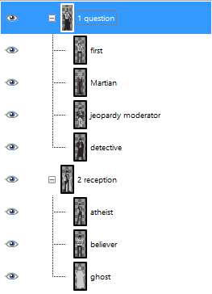

Installation
==================
See:
- http://www.gimp.org/docs/python/
- http://www.gimpusers.com/tutorials/install-python-for-gimp-2-6-windows
- http://www.exp-media.com/content/extending-gimp-python-python-fu-plugins-part-1

Export Fancy Annotated Spritesheet
==================================
Python plugin script to create a fancy spritesheet preview.

Requirements:
- sprites have uniform size, each sprite in a separate layer
- there are multiple group layers (GIMP 2.8+) at the root
- each group layer contains multiple sprites
Will open a new image containing the spritesheet.
The annotations are taken directly from the group / layer names.

### Screenshots

Expected layer structure:

Expected result:

It's a single-purpose script, tweak at your own will for other purposes

Export Grouped Spritesheet
==================================
Python plugin script to export a uniform spritesheet.

Requirements:
- sprites have uniform size, each sprite in a separate layer
- sprite layers scattered across the hierarchy of group layers (GIMP 2.8+)
Will open a new image containing the spritesheet and optionally export a .png directly.

### Screenshots

"layer_structure.png" - an example layer structure

 

"export_grouped_spritesheet.png" - plugin window

 

"exported_spritesheet.png" - expected result
